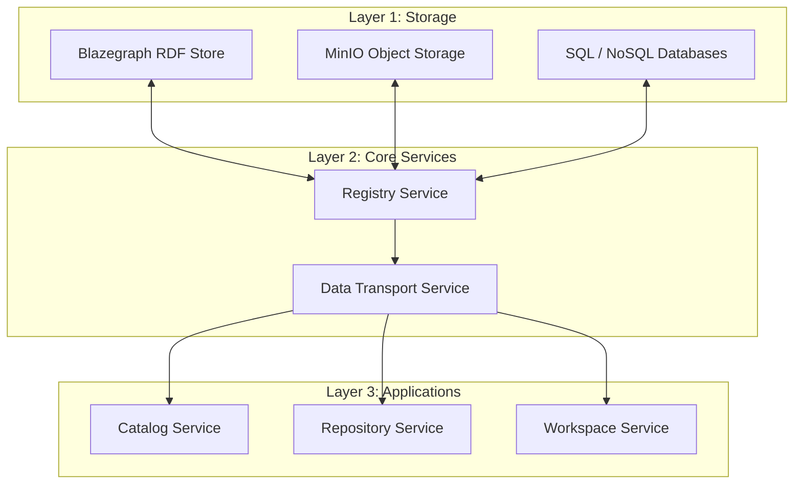
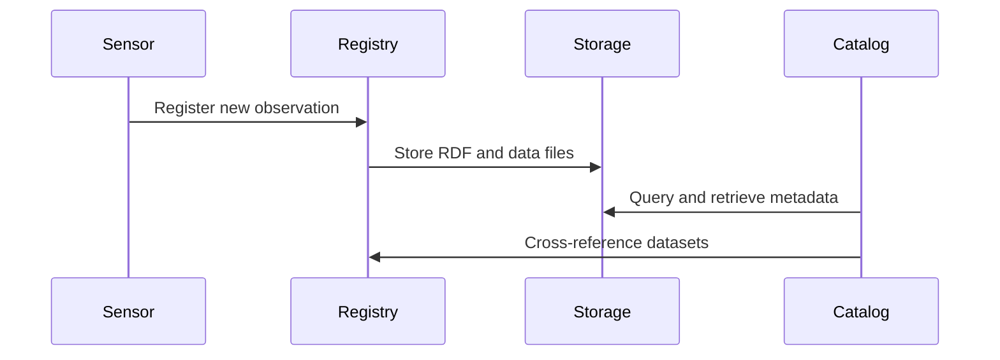

## Table of Contents

- [Introduction](#introduction)
- [Service Layers](#service-layers)
- [Data Flow](#data-flow)
- [Ontologies](#ontologies)

## Introduction

The Scientific Data Layer (SDL) uses a **system-of-systems architecture** based on microservices.
It provides linked data capabilities for managing scientific data using standards like SSN, DCAT, and PROV.

## Service Layers

The architecture is organized into **three layers**:

## Data Flow

