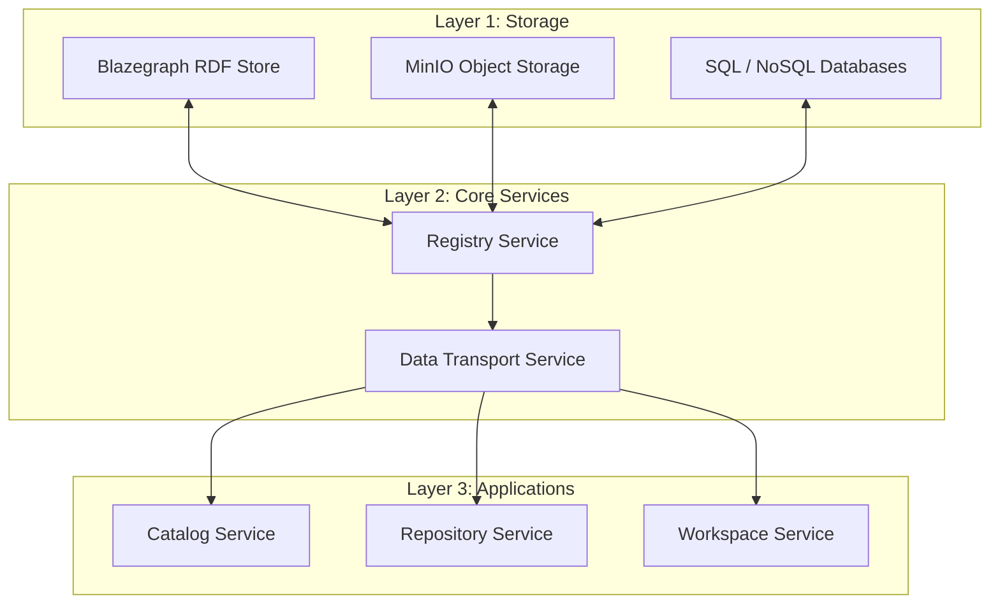
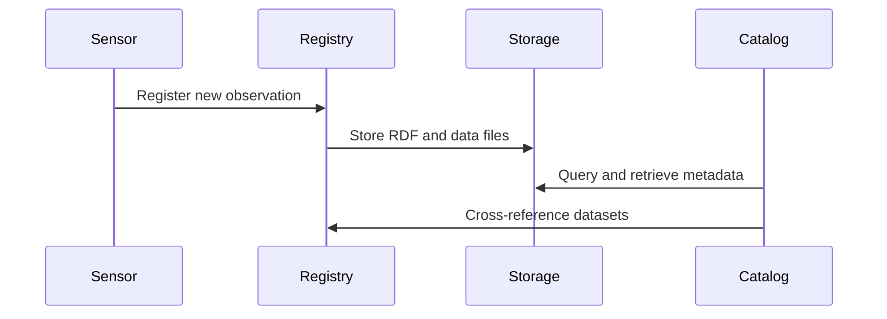

> **Disclaimer:** Many of the features described in this guide are still in planning or active development. Some functionality may not yet be available in your instance.

The Scientific Data Layer (SDL) is a modular and extensible platform designed to manage scientific data using semantic web principles. It implements a system-of-systems architecture composed of microservices and semantic UI components. It provides linked data capabilities for managing scientific data using standards like SSN, DCAT, and PROV.

This guide introduces the SDL architecture, highlighting its main frontend and backend components and their interactions.

---

## Architectural Principles

SDL is built upon the following design principles:

- **Linked Data Platform (LDP)**: Resources are addressable and follow LDP standards.
- **Microservices**: Each core function is encapsulated as an independent Python-based service.
- **Semantic Interoperability**: Uses RDF, JSON-LD, and standard ontologies (e.g., DCAT, SSN, DoCO).

  → [[ontologies|See the Overview of Namespaces Used in SDL]]

- **Polyglot Storage**: Supports RDF triple stores, object storage, SQL, and NoSQL.
- **Extensibility**: Modular components and shared libraries for reusability.

  Semantic classes in SDL are composed from multiple ontologies and aligned to platform-specific requirements using RDF typing and graph separation. This composition enables semantic forms, content blocks, and workflows to be inferred and rendered dynamically.

  → [[entity_overview|See the Overview of Semantic Classes Used in SDL]]

---

## System Diagram

``` sh
[ User Interface (SvelteKit) ]
          |
          v
[ API Gateway / Middleware Layer ]
          |
+-------------------------------+
|         Backend Services      |
|-------------------------------|
| Catalog     | Registry        |
| Repository  | Workspace       |
| Storage     | Data Transfer   |
+-------------------------------+
          |
+-------------------------------+
|         Storage Layer         |
|-------------------------------|
| Blazegraph | MinIO | Postgres |
+-------------------------------+
```

---

## Frontend (SvelteKit UI)

The frontend is a modern, reactive application built with **SvelteKit**, structured as:

- A **component library** for reusable, semantically-aware UI elements (e.g., inputs, RDF viewers, content blocks)
- A **resource representation library** for mapping RDF resources to JavaScript/TypeScript objects with context-aware utilities
- A **workspace-driven application shell** inspired by Notion, enabling semantic content authoring and navigation

Key features:

- Semantic content editing
- Dynamic rendering by `rdfs:type`
- RDF-aware forms and views
- Component-driven architecture (Storybook supported)
- SPARQL-based dashboards (planned)

It interacts with backend services through a JSON-LD-aware API gateway.

---

## Backend Services

Each backend service is implemented in Python and communicates over REST, with plans to support GraphQL/SPARQL endpoints.

### Service Layers

The architecture is organized into **three layers**:



### Catalog Service

- Manages DCAT catalogs, datasets, distributions
- Supports search, indexing, and metadata publishing

### Registry Service

- Manages identities of platforms, systems, sensors
- Supports SSN/PROV alignment and platform hierarchy

### Repository Service

- Manages versioned RDF content
- Implements LDP containers and SPARQL endpoints

### Workspace Service

- Handles user-defined spaces for organizing content
- Manages RBAC, dashboards, templates

### Storage Service

- Maps logical stores to physical backends
- Coordinates access to Blazegraph, MinIO, Postgres, etc.

### Data Transfer Service

- Manages asynchronous and bulk data movement
- Tracks provenance of imports/exports

### Data Flow



---

## Shared Infrastructure

- **Blazegraph**: RDF triple store for SPARQL and semantic queries
- **MinIO**: Object storage for raw files and binary content
- **PostgreSQL**: For structured metadata and auxiliary indexing
- **MongoDB**: NoSQL document store for unstructured metadata and lightweight assets
- **NGINX**: Reverse proxy and static file serving, load balancing
- **AMP/MQTT**: Messaging protocol layer for real-time telemetry and data synchronization

---

## DevOps and Deployment

SDL is designed to be containerized using Docker and orchestrated with Kubernetes. Each service runs independently and can scale horizontally.

- CI/CD pipelines for microservices
- Configurable namespace mapping and graph isolation
- OAuth2-compatible authentication layer

---

## Future Directions

- Event-driven messaging layer (e.g., Kafka)
- Federation across SDL instances
- Provenance-based automation and reasoning
- Ontology-aligned workflow engines

---

SDL provides a flexible foundation for semantic scientific infrastructures. Its modular design supports both experimental and production-scale deployments.
